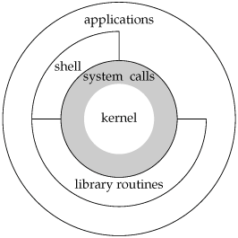

# Chapter 1: UNIX System Overview
Notes from *Advanced Programming in the UNIX Environment, 3rd Edition by Stevens & Rago* taken by Sarthak Khillon.
Definitions/keywords are provided in **bold type**, code/filepaths are `monospaced type`, and notes/other important information is stressed with *italics type*.

## 1.1 - Introduction
- All Operating Systems (OS) provide services for programs they run.
- Typical services include:
    - Executing a new program
    - File I/O
    - Allocating a memory block
    - Getting current time
    - and many more!

## 1.2 - UNIX Architecture
The following definitions describe Figure 1.1:

- **Operating System**: The software that controls the hardware resources of the computer and provides an environment under which programs can run. 
- **Kernel**: The software part. Called the kernal (reference to nuts) because it's small and at the core of the environment.
- **System Calls**: The interface (bridge) between programs and the kernal. 
- **Library routines**: Common software that has been pre-written so you don't reinvent the wheel. Applications are typically built above this layer, but they don't have to.
- **Shell**: A special application that provides an interface for running other applications. At the same layer as library routines.

- **Linux** is the kernel used by the **GNU OS**. Properly, this combination would be called the "GNU/Linux OS", but most people just refer to it as "Linux".

## 1.3 - Logging In
### Login Name
- We login with our **login name** and **password**.
- System looks up login name in password file (usually `/etc/passwd`).
    - Entries are seven colon-separated fields: `login_name:encrypted_password:numeric_user_id:numeric_group_id:comment_field:home_directory:shell_program`.
    - Example of real entry:
    `sar:x:205:105:Stephen Rago:/home/sar:/bin/ksh`
    - *Note: Newer systems have moved the encrypted password to an entirely different file.*

### Shells
- **Shell**: A command-line interpreter that reads user input and executes commands.
    - User input is usually through a terminal or a file (called a **shell script**).
    - Examples of shells on different operating systems:
        - Bourne shell (sh)
        - Bourne-again shell (bash) *<- Standard on my Macbook Pro running OSX High Sierra*
        - C shell (csh)
        - Korn shell (ksh)
        - TENEX C shell (tcsh)
    - Recall that the final entry in the password file describes which shell to use.

## 1.4 - Files and Directories
### File System
- The UNIX file system is a hierarchical arrangement of directories and files.
- Structured like a tree: everything starts in the **root directory**, which is indicated by a single slash `/`.
- **Directory**: A file that contains directory entries.
    - **Directory Entry**: A filename along with a structure of information describing file attributes such as filetype, size, owner, permissions, and date of last modification. This information is obtained by calling `stat` or `fstat`.

### Filename
- **Filename**: The names in a directory. Cannot contain `/` or `\0` as `/` separates the filenames that form a pathname and `\0` terminates strings. However, for portability, POSIX recommends using only alphabetic letters, numbers, periods, dashes, and underscores. Most commercial UNIX systems support filenames at least 255 characters long.
- Whenever a new directory is created, two filenames are created with it:
    - `.` (**dot**) refers to the current directory.
    - `..` (**dot-dot**) refers to the parent directory. In the root directory, dot-dot is the same as dot.

### Pathname
- **Pathnames** are sequences of one or more filenames separated by slashes and optionally starting with a slash.
- **Absolute pathnames** begin with the root slash. Think of it like giving directions with coordinates.
- **Relative pathnames** do not begin with the root slash. Think of it like a GPS, where the starting point is the current directory and the path is directions.

Listing the contents of a directory is done with the `ls` command. A bare-bones implementation is given below (details about this code will be given in Chapter 4):
```c
#include "apue.h"
#include <dirent.h>

int main(int argc, char *argv[]) {
    DIR *dp;
    struct dirent *dirp;
    
    if (argc != 2)
        err_quit("usage: ls directory_name");
    if ((dp = opendir(argv[1])) == NULL)
        err_sys("can’t open %s", argv[1]);
    while ((dirp = readdir(dp)) != NULL)
        printf("%s\n", dirp->d_name);
    closedir(dp);
    exit(0); 
}
```

*For more information about a specific UNIX command, consult the manual by typing `man <command>` into your terminal.*

*You can compile your C programs into executables by using your version of the C compiler (`cc`). On modern systems with GNU C distributions, you should use `gcc`: `gcc myls.c` creates an executable file called `a.out`.*

### Working Directory
- Every process has a **working directory** (sometimes referred to as a "current working directory").
- A process can change its working directory with the `chdir` function.
- A user may see the working directory with the `pwd` command in a terminal.

### Home Directory
On login, the working directory is set to the **home directory** specified in our password file entry.

## 1.5 - Input and Output
### File Descriptors
- **File Descriptor**: Small, non-negative (unsigned) integers that the kernel uses to identify the files accessed by a process.
- When we open an existing file or create a new file, the kernel returns a file descriptor that we can use to identify the file in our program.
- *Note that a file DOES NOT HAVE ONE FILE DESCRIPTOR FOREVER! It is only unique for the current process and then freed once the process finishes execution.*

### Standard Input, Standard Output, and Standard Error
- All shells open 3 file descriptors whenever a new program is run: **standard input**, **standard output**, and **standard error**. If nothing special is done, then these descriptors are connected to the terminal.
- You may redirect standard input to a file with `<` and standard output with `>`:
`$ ./a.out < myinputfile > myoutputfile`

### Unbufferd I/O
- Provided by the functions `open, read, write, lseek` and `close`. These functions all take file descriptors as arguments.
- The `<unistd.h>` header contains the functions above.
- Generally standard input is 0 and standard output is 1. However, for portability, you should always use the constants `STDIN_FILENO` and `STDOUT_FILENO`.

### Standard I/O
- If you don't want to be thinking about proper buffer sizes for your input, you can use the buffered I/O functions described in `<stdio.h>`. Examples include `fgets()` and `printf()`.
- This header file also contains the constants `stdin`, `stdout`, and `EOF`.

## 1.6 - Programs and Processes
### Program
- **Program**: An executable file residing on disk in a directory.
- A program is run by loading it into memory and executing by the kernel with one of the seven `exec` functions (described in Sections 8.10).

### Processes and Process ID
- **Process**: An executing instance of a program (sometimes called a **task**).
- UNIX guarantees a unique numeric identifier called the **process ID**, which is always an unsigned integer.

### Process Control
- 3 functions: `fork(), exec(),` and `waitpid()`.
- There are 7 variants of the `exec` function, but they are collectively referred to by the same name.

### Threads and Thread IDs
- Usually a process only has 1 **thread**; 1 set of machine instructions executing at a time.
- Multiple threads of control can make some problems easier by breaking it up.
- A process can create threads, defined by IDs, which are local to a process.
- See more in Chapter 12.

## 1.7 - Error Handling
- When one of the UNIX System function fails, they usually return a negative integer (and also set `errno` to a value that gives more information). This is defined in `<errno.h>`.
- `errno` is NEVER cleared by a routine if an error does not occur, so its value should only be checked if a negative value is returned from a system function.
- Two functions that help:
    - `char *strerror(int errnum);`: maps `errnum`, typically an `errno` value, into an error message string and returns a pointer to the string.
    - `void perror(const char *msg);`: outputs the string pointed to by message, followed by a colon and space, followed by an error message corresponding to the current value of `errno`, followed by a newline.

### Error Recovery
- There are two types of errors in `<errno.h>`: **fatal** errors that cannot be recovered and kill the process, and **nonfatal** errors can be handled more robustly and may not occur if the process is run at a later time (ex: memory shortage).
- Best way to deal with nonfatal errors is to wait an appropriate amount of time and try again.

## 1.8 - User Identification
### User ID
- **User ID** is an entry in the password file that identifies the user to the system. It is assigned by the system administrator on login and can never be changed.
- A user with an ID of 0 is called the **root user** or **superuser**. Any process with superuser priviliges can bypass most file permission checks, and can access special operating system functions. The superuser has free rein over the system.
- *Note: The client version of Mac OSX ships with superuser account disabled.*

### Group ID
- **Group ID** is very similar to User ID, except that it identifies groups of users with the same priviliges. This allows sharing of resources between members of the same group.
- Every file on disk stores both the userID and groupID of a file's owner, which saves disk space since it only uses 4 bytes per ID.
- To get the actual user as a string, the file maintains a link to the password entry which gets information in human-readable form.

### Supplementary Group IDs
Users can belong to up to 16 additional groups, identified by **supplementary group IDs**.

## 1.9 - Signals

## 1.10 - Time Values

## 1.11 - System Calls and Library Functions

